<head>
    
    
</head>

- [Array](#array)
- [Stack](#stack)
- [Queue](#queue)
- [Deque](#deque)
- [Linked List](#linked-list)
  - [Singly Linked List](#singly-linked-list)
  - [Circularly Linked List](#circularly-linked-list)
  - [Doubly Linked List](#doubly-linked-list)
  - [Positional List](#positional-list)
- [Array-based vs. Linked-based](#array-based-vs-linked-based)
- [Tree](#tree)
  - [General Tree](#general-tree)
  - [Binary Tree](#binary-tree)
  - [Implementations](#implementations)
    - [Linked Binary Tree](#linked-binary-tree)
    - [Array-based Binary Tree](#array-based-binary-tree)
    - [Linked General Tree](#linked-general-tree)
  - [Tree Traversal Algorithms](#tree-traversal-algorithms)
    - [Preorder (General Tree)](#preorder-general-tree)
    - [Postorder (General Tree)](#postorder-general-tree)
    - [Breadth-first (General Tree)](#breadth-first-general-tree)
    - [Inorder (Binary Tree)](#inorder-binary-tree)
- [Priority Queue](#priority-queue)
  - [Unsorted Priority Queue](#unsorted-priority-queue)
  - [Sorted Priority Queue](#sorted-priority-queue)
  - [Sorting with Priority Queue](#sorting-with-priority-queue)
  - [Adaptable Priority Queue](#adaptable-priority-queue)
- [Heap](#heap)
  - [Heap-based Priority Queue](#heap-based-priority-queue)
  - [Heap-Sort](#heap-sort)
- [Map](#map)
- [Hash Table](#hash-table)
  - [Hash Functions](#hash-functions)
    - [Hash codes](#hash-codes)
    - [Compression functions](#compression-functions)
  - [Collision-handling schemes](#collision-handling-schemes)
    - [Separate Chaining](#separate-chaining)
    - [Open Addressing](#open-addressing)
      - [Linear Probing](#linear-probing)
      - [Quadratic Probing](#quadratic-probing)
      - [Double Hashing](#double-hashing)
  - [Rehashing](#rehashing)
  - [Sorted Search Table](#sorted-search-table)
  - [Set](#set)
- [Search Tree](#search-tree)
  - [Binary Search Tree](#binary-search-tree)

\pagebreak

# Array

**Referential array.** Array of object references.

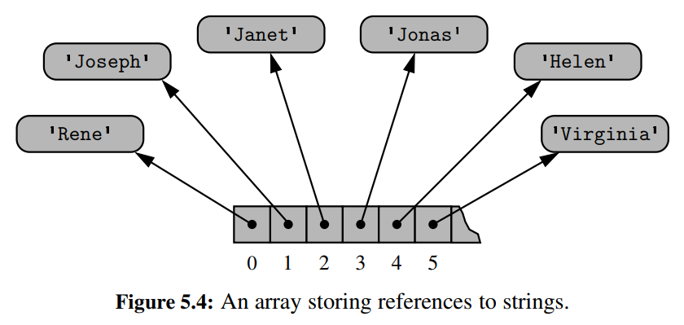

E.g., Python lists, tuples.

**Compact array.** Array that store bits representing primary data.

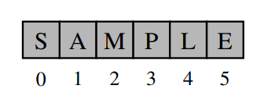

**Dynamic array.** Resizable array that grows or shrinks based on the number of items it contains, so that its operations can have amortized $O(1)$ runtime.

E.g., Python list is implemented using dynamic array.

| Operation                                   | Runtime                      |
|---------------------------------------------|------------------------------|
| `data[j] = val`                             | $O(1)$                       |
| `data.append(value)`                        | $O(1)$*                      |
| `data.insert(k, value)`                     | $O(n-k+1)$* (element shifts) |
| `data.pop()`                                | $O(1)$*                      |
| `data.pop(k)`  `del data[k]`            | $O(n-k)$* (element shifts)   |
| `data.remove(value)`                        | $O(n)$*                      |
| `data1.extend(data2)`  `data1 += data2` | $O(n_2)$*                    |
| `data.reverse()`                            | $O(n)$                       |
| `data.sort()`                               | $O(n\log n)$                 |

* Amortized.

\pagebreak

# Stack

| Method         | Description                               | Runtime |
|----------------|-------------------------------------------|---------|
| `S.push(e)`    | Add e to top of stack.                    | $O(1)$* |
| `S.pop()`      | Remove and return item from top of stack. | $O(1)$* |
| `S.top()`      | Return reference to item at top of stack. | $O(1)$  |
| `S.is_empty()` | True if the stack is empty.               | $O(1)$  |
| `len(S)`       | Return the number of items in the stack.  | $O(1)$  |

*If implemented using a Python list, these operations are amortized.

Applications: 
1. Reverse a list (push all items in and pop them one by one, first in last out). 
2. Parenthesis matching.

\pagebreak

# Queue

| Method         | Description                                 | Runtime |
|----------------|---------------------------------------------|---------|
| `Q.enqueue(e)` | Add `e` to end of queue.                    | $O(1)$* |
| `Q.dequeue()`  | Remove and return item from front of queue. | $O(1)$* |
| `Q.first()`    | Return item at front of queue.              | $O(1)$  |
| `Q.is_empty()` | True if the queue is empty.                 | $O(1)$  |
| `len(Q)`       | Return the number of items in the queue.    | $O(1)$  |

*If implemented using a Python list (circular, wraps around when reaching end of list), these operations are amortized.

\pagebreak

# Deque

Double-ended queue. ADT that can add and remove elements from both ends of the queue.

| Method                                  | Description                                          | Runtime |
|-----------------------------------------|------------------------------------------------------|---------|
| `D.add_first(e)`, `D.add_last(e)`       | Add `e` to front/back of dequeue.                    | $O(1)$* |
| `D.delete_first(e)`, `D.delete_last(e)` | Remove and return item from front/back of dequeue.   | $O(1)$* |
| `D.first()`, `D.last()`                 | Return and return item at the front/back of dequeue. | $O(1)$  |
| `D.is_empty()`                          | True if the dequeue is empty.                        | $O(1)$  |
| `len(D)`                                | Return the number of items in the dequeue.           | $O(1)$  |

*If implemented using a Python list (circular, wraps around), these operations are amortized.

\pagebreak

# Linked List

## Singly Linked List

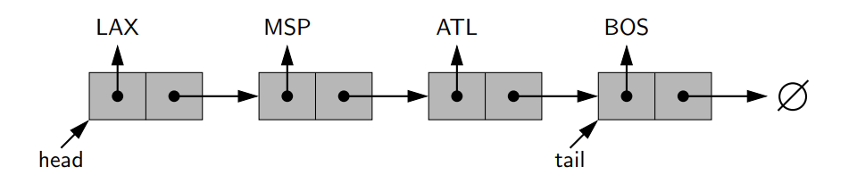

Applications:
1. Implement the Stack ADT, all operations are worst-case $O(1)$.
2. Implement the Queue ADT, all operations are worst-case $O(1)$.

## Circularly Linked List

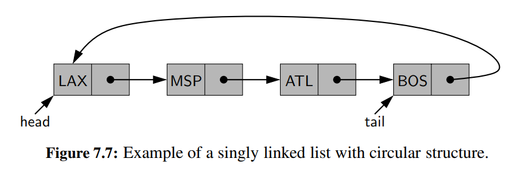

Applications:
1. Implement the Queue ADT, with more efficient method for wrapping around.

## Doubly Linked List

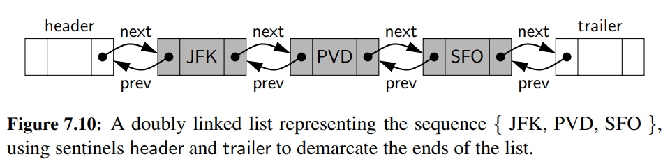

Applications:
1. Implement the Deque ADT.
2. Implement the Positional List ADT.

## Positional List

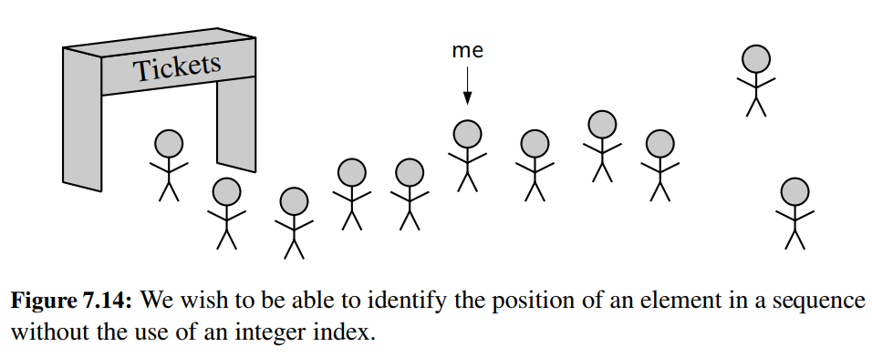

| Method                                    | Description                                                |
|-------------------------------------------|------------------------------------------------------------|
| `L.first()`, `L.last()`                   | Return the position of the first/last item.                |
| `L.before(p)`, `L.after(p)`               | Return the position immediately before/after position `p`. |
| `L.is_empty()`                            | True if the positional list is empty.                      |
| `len(L)`                                  | Return the number of items in the positional list.         |
| `iter(L)`                                 | Return a forward iterator of items in the positional list. |
| `L.add_first(e)`, `L.add_last(e)`         | Add `e` to the front/back of the positional list.          |
| `L.add_before(p, e)`, `L.add_after(p, e)` | Add `e` before/after position `p`.                         |
| `L.replace(p, e)`                         | Replace the item at position `p` with `e`.                 |
| `L.delete(p)`                             | Remove and return the item at position `p`.                |

Applications:
1. Maintain access frequencies.

\pagebreak

# Array-based vs. Linked-based

| Metrics               | Array-based                                | Link-based                                                |
|-----------------------|--------------------------------------------|-----------------------------------------------------------|
| access based on index | $O(1)$                                     | $O(n)$                                                    |
| search                | $O(\log n)$ if sorted (binary search)      | $O(n)$                                                    |
| insertion, deletion   | $O(n)$ worst case (need to shift elements) | $O(1)$ at arbitrary position                              |
| memory usage          | $2n$ worst case (after resize)             | $2n$ for singly-linked lists $3n$ for doubly-linked lists |

Compromise between array-based and link-based structures: Skip lists achieve average $O(\log n)$ search and update operations via a probabilistic method.

\pagebreak

# Tree

## General Tree

A tree $T$ is set of nodes storing elements such that the nodes have a parent-child relationship that satisfies the following properties:
* If $T$ is nonempty, it has a special node, called the root of $T$ , that has no parent.
* Each node $v$ of $T$ different from the root has a unique parent node $w$; every node with parent $w$ is a child of $w$.

**Sibling.** Two nodes are siblings if they have the same parent node.

**External.** A node is external if it has no children. A.k.a leaves.

**Internal.** A node is internal if it has >= 1 children.

**Edge.** An edge of tree $T$ is a pair of nodes $(u,v)$ such that $u$ is the parent of $v$, or vice versa.

**Path.** A path of $T$ is a sequence of nodes such that any two consecutive nodes in the sequence form an edge.

**Ordered Tree.** A tree is ordered if there is a meaningful linear order among the children of each node.

**Depth of node.** The depth of a node is the number of its ancestors, excluding itself.

**Depth of node (recursive).** If $p$ is the root, then its depth is $0$. Otherwise, the depth of $p$ is $1 +$ depth of $p$'s parent.

**Height of node (recursive).** If $p$ is a leaf, then its height is $0$. Otherwise, the height of $p$ is $1 +$ the maximum of $p$'s children's heights.

**Height of tree.** The height of a tree is the height of its root.

| Method              | Description                                         |
|---------------------|-----------------------------------------------------|
| `T.root()`          | Return the position of the tree's root.             |
| `T.is_root(p)`      | True if position `p` is the tree's root.            |
| `T.parent(p)`       | Return the position of `p`'s parent.                |
| `T.num children(p)` | Return the number of `p`'s children.                |
| `T.children(p)`     | Generate an iteration of position `p`'s children.   |
| `T.is leaf(p)`      | True if position `p` does not have any children.    |
| `len(T)`            | Return the number of positions in the tree.         |
| `T.is empty()`      | True if the tree does not contain any position.     |
| `T.positions()`     | Generate an iteration of the positions in the tree. |
| `iter(T)`           | Generate an iteration of the elements in the tree.  |
| `T.depth(p)`        | Return the depth of `p`.                            |
| `T.height(p)`       | Return the height of `p`.                           |

**Proposition.** The height of a nonempty tree is the maximum of its leaves' depths.

**Proposition.** In a tree with $n$ nodes, the sum of the number of children of all nodes is $n-1$.

**Proof.** Every node except for the root is some other node's child.

## Binary Tree

**Binary tree.** A binary tree is an ordered tree such that:
1. Every node has at most two children.
2. Each child node is either a left child or a right child.
3. A left child precedes a right child in the order of children of a node.

**Binary tree (recursive).** A binary tree is either empty or consists of:
* A node $r$, called the root of $T$, that stores an element
* A binary tree (possibly empty), called the left subtree of $T$
* A binary tree (possibly empty), called the right subtree of $T$

| Method                    | Description                                    |
|---------------------------|------------------------------------------------|
| `T.left(p)`, `T.right(p)` | Return the position of `p`'s left/right child. |
| `T.sibling(p)`            | Return the position of `p`'s sibling.          |

**Proper/Full.** A binary tree is proper or full if each node has either zero or two children. That is, all its internal nodes have two children.

**Proposition.** In a nonempty proper binary tree $T$, with $n_E$ external nodes and $n_I$ internal nodes, we have $n_E = n_I +1$.

**Proof.** If $h$ is $T$'s height, then $n_E = 2^h$, $n_I = 2^0 + 2^1 + 2^2 + \cdots 2^h = 2^h-1$.

## Implementations

### Linked Binary Tree

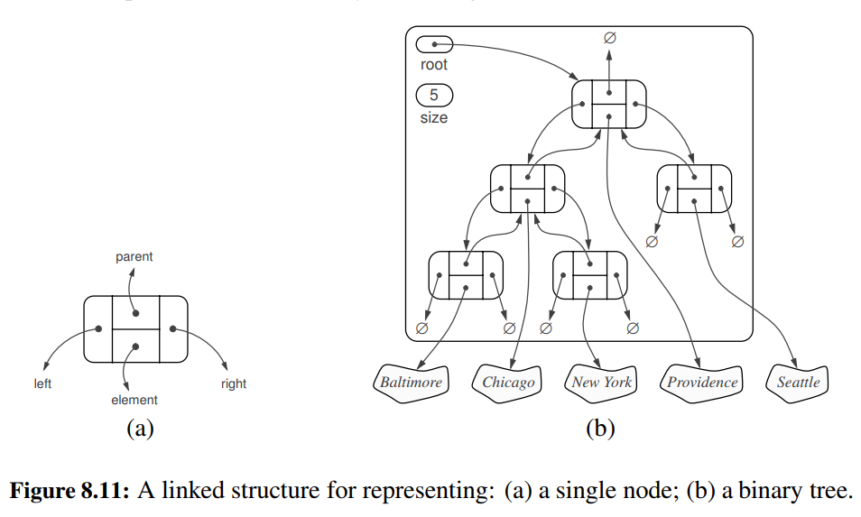

| Method                                  | Description                                                         |
|-----------------------------------------|---------------------------------------------------------------------|
| `T.add_root(e)`                         | Add root `e` to an empty tree.                                      |
| `T.add_left(p, e)`, `T.add_right(p, e)` | Add `e` as left/right child to `p`.                                 |
| `T.replace(p, e)`                       | Replace element at position `p` with `e`.                           |
| `T.delete(p)`                           | Remove the node at position `p` and replace it with its only child. |
| `T.attach(p, T1, T2)`                   | Attach `T1`, `T2` as left and right subtress of the leaf `p`.       |

| Operation                                                                | Runtime    |
|--------------------------------------------------------------------------|------------|
| `len`, `is_empty`                                                        | $O(1)$     |
| `root`, `parent`, `left`, `right`, `sibling`, `children`, `num_children` | $O(1)$     |
| `is_root`, `is_leaf`                                                     | $O(1)$     |
| `depth(p)`                                                               | $O(d_p+1)$ |
| `height`                                                                 | $O(n)$     |
| `add_root`, `add_left`, `add_right`, `replace`, `delete`, `attach`       | $O(1)$     |

### Array-based Binary Tree

For every position $p$ of $T$ , let $f(p)$ be the integer defined as follows.
• If $p$ is the root of $T$, then $f(p) = 0$.
• If $p$ is the left child of position $q$, then $f(p) = 2f(q) + 1$.
• If $p$ is the right child of position $q$, then $f(p) = 2f(q) + 2$.

**Array-based binary tree.** An array-based structure $A$ (such as a Python list), with the element at position $p$ of $T$ stored at $A[f(p)]$.

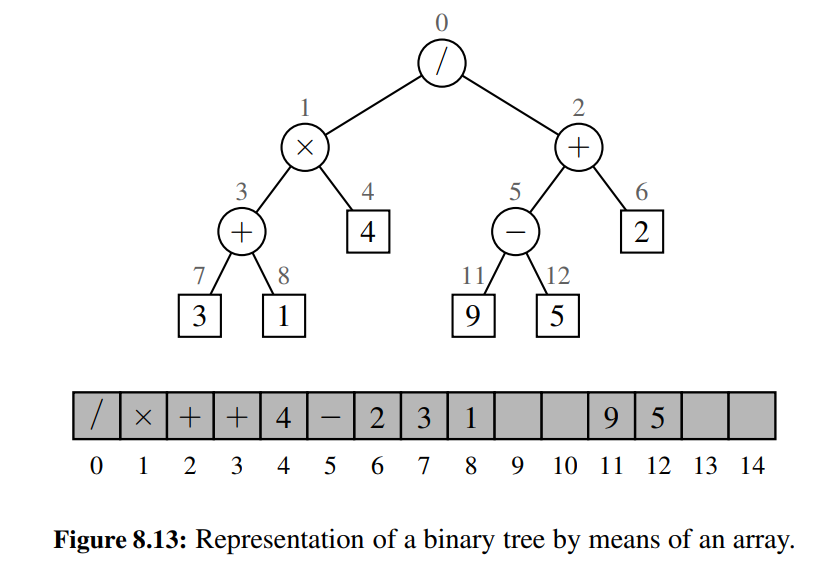

`delete` is $O(n)$ as all the node's descendents need to be shifted in the array.

### Linked General Tree

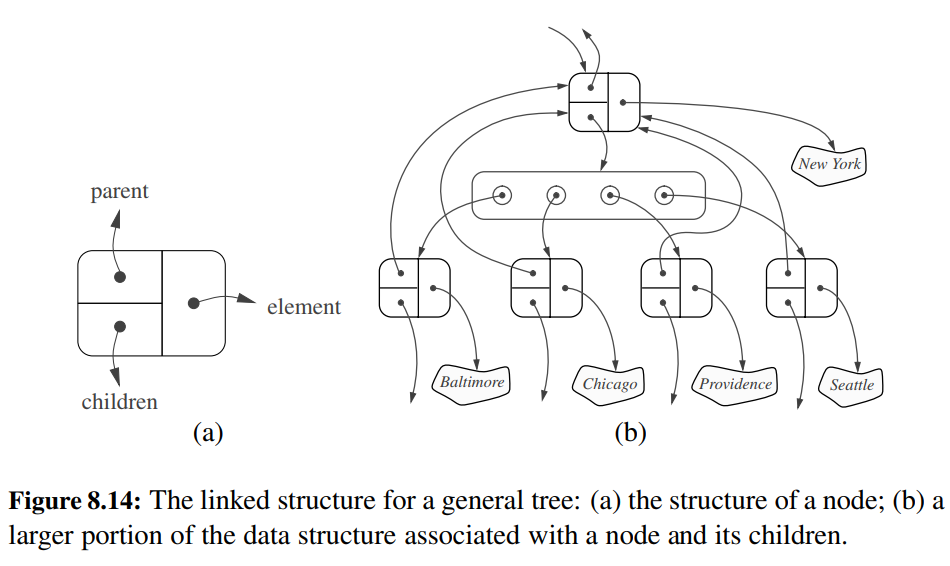

| Operation                              | Runtime    |
|----------------------------------------|------------|
| `len`, `is_empty`                      | $O(1)$     |
| `root`, `parent`, `is_root`, `is_leaf` | $O(1)$     |
| `children(p)`                          | $O(c_p+1)$ |
| `depth(p)`                             | $O(d_p+1)$ |
| `height`                               | $O(n)$     |

## Tree Traversal Algorithms

Traversals are $O(n)$ as they must visit every node in the tree.

Binary search is $O(\log n)$ in a proper binary tree.

### Preorder (General Tree)

Visit node, then visit node's children.

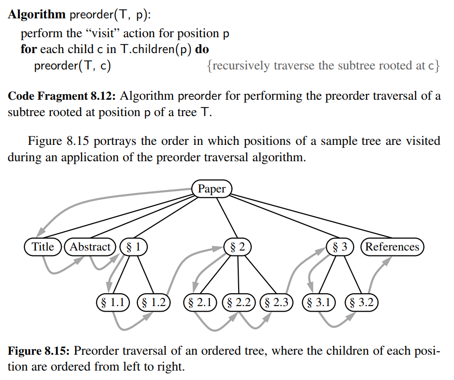

### Postorder (General Tree)

Visit node's children, then visit node.

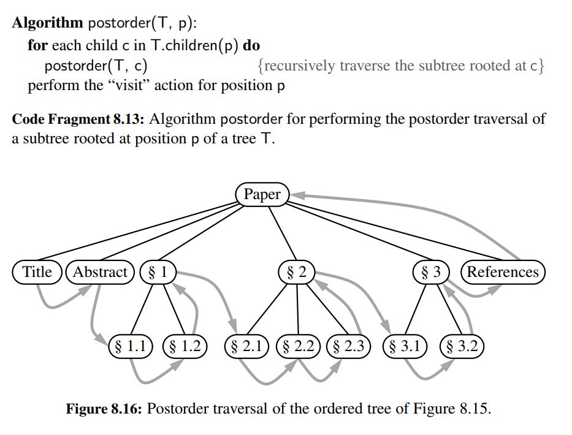

### Breadth-first (General Tree)

Visit nodes level by level.

Not recursive.

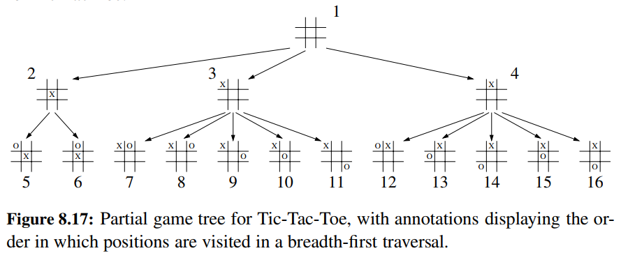

Dequeue to get node. Visit node, then enqueue node's children.

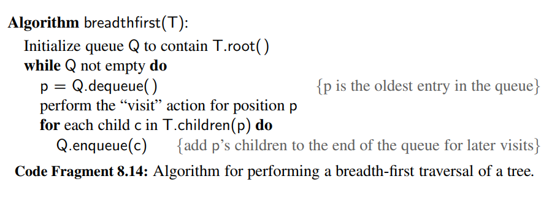

### Inorder (Binary Tree)

Visit left subtree. Visit right subtree. Visit node.

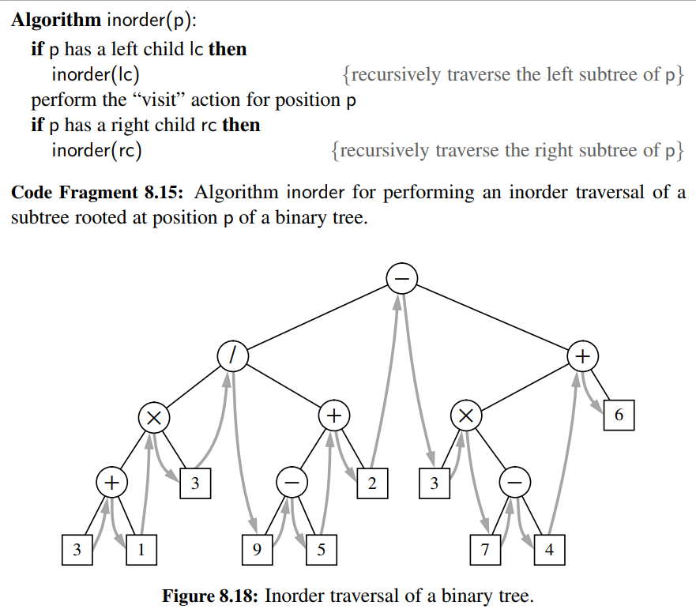

\pagebreak

# Priority Queue

| Method           | Description                                                           |
|------------------|-----------------------------------------------------------------------|
| `P.add(k, v)`    | Add item with key `k` and value `v` into the priority queue.          |
| `P.min()`        | Return item with the minimum key in the priority queue.               |
| `P.remove_min()` | Remove and return an item with the minimum key in the priority queue. |
| `P.is_empty()`   | True if the priority queue is empty.                                  |
| `len(P)`         | Return the number of items in the priority queue.                     |

## Unsorted Priority Queue

Add item to the end of the priority queue, find minimum to remove in $O(n)$.

$O(1)$ insertions, $O(n)$ removals (best-case, because it always takes $O(n)$ to find the minimum).

| Method           | Runtime |
|------------------|---------|
| `P.add(k, v)`    | $O(1)$  |
| `P.min()`        | $O(n)$  |
| `P.remove_min()` | $O(n)$  |
| `P.is_empty()`   | $O(1)$  |
| `len(P)`         | $O(1)$  |

## Sorted Priority Queue

Maintain sortedness when inserting items, minimum is at front of the priority queue,

$O(n)$ insertions (best-case is $O(1)$, because the items may come in as sorted), $O(1)$ removals.

| Method           | Runtime |
|------------------|---------|
| `P.add(k, v)`    | $O(n)$  |
| `P.min()`        | $O(1)$  |
| `P.remove_min()` | $O(1)$  |
| `P.is_empty()`   | $O(1)$  |
| `len(P)`         | $O(1)$  |

## Sorting with Priority Queue

1. Add each item one by one to the priority queue.
2. Keep removing the minimum from the priority queue.

| Implementation/Operation | `add`                                                 | `remove_min`                                 |
|--------------------------|-------------------------------------------------------|----------------------------------------------|
| Unsorted List            | Add to the end of list in $O(1)$.                     | Find minimum to remove in best-case $O(n)$.  |
| Sorted List              | Insert into sorted list in $O(n)$ (best-case $O(1)$). | Remove minimum from front of list in $O(1)$. |

With unsorted list-based priority queue, this is selection-sort (best case $O(n^2)$). With sorted list-based priority queue, this is insertion-sort (best-case $O(n)$).

## Adaptable Priority Queue

Additional operations:
1. Remove arbitrary entry.
2. Update the key (priority) of exiting entry.

\pagebreak

# Heap

A heap is a binary tree $T$ that stores a collection of items at its positions and that satisfies the following two properties:

**Heap-Order Property.** (relational): In a heap $T$, for every position $p$ other than the root, the key stored at $p$ >= the key stored at $p$’s parent.

This implies that the minimum item is at the heap's root.

**Complete Binary Tree Property.** (structural): A heap $T$ with height $h$ is a complete binary tree if levels $0,1,2, \ldots ,h− 1$ of $T$ have the maximum number of nodes possible and the remaining nodes at level $h$ reside in the leftmost positions.

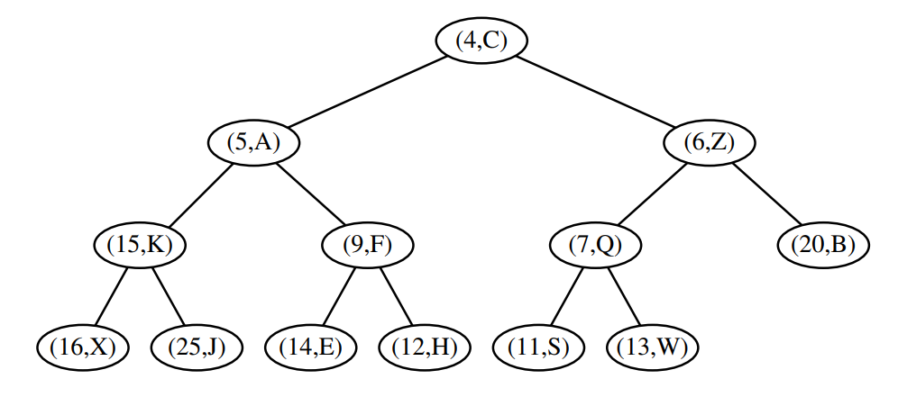

**Proposition.** A heap $T$ storing $n$ entries has height $h = \text{floor}(\log n)$.

## Heap-based Priority Queue

Add:
1. Add item to rightmost node at bottom level to maintain completeness.
2. Up-heap bubbling to swap the new node into correct position to maintain heap-order.

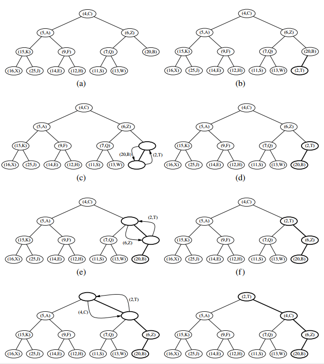

Remove:
1. Remove minimum item from top of heap (root).
2. Copy item at rightmost node at bottom level to root.
3. Down-heap bubbling to swap the node into correct position to maintain heap order.

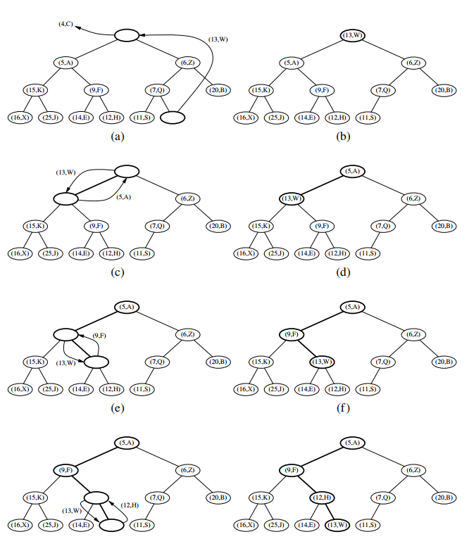

| Method           | Runtime      |
|------------------|--------------|
| `P.add(k, v)`    | $O(\log n)$* |
| `P.min()`        | $O(1)$       |
| `P.remove_min()` | $O(\log n)$* |
| `P.is_empty()`   | $O(1)$       |
| `len(P)`         | $O(1)$       |

*For array-based-tree-based heap, this is amortized, but array-based heap can locate last position in $O(1)$ via index access.

| Implementation/Operation | `add`                                                                         | `remove_min`                                                                                                                              |
|--------------------------|-------------------------------------------------------------------------------|-------------------------------------------------------------------------------------------------------------------------------------------|
| Unsorted List            | Add to the end of list in $O(1)$.                                             | Insert into sorted list in $O(n)$.                                                                                                        |
| Sorted List              | Find minimum in $O(n)$ to remove.                                             | Remove minimum from front of list in $O(1)$.                                                                                              |
| Array-based Heap         | 1. Find last position in $O(1)$. 2. Up-heap bubbling in $O(\log n)$.      | 1. Remove minimum at root in $O(1)$. 2. Find last position and copy to root in $O(1)$. 3. Down-heap bubbling in $O(\log n)$.      |
| Linked Heap              | 1. Find last position in $O(\log n)$. 2. Up-heap bubbling in $O(\log n)$. | 1. Remove minimum at root in $O(1)$. 2. Find last position and copy to root in $O(\log n)$. 3. Down-heap bubbling in $O(\log n)$. |

## Heap-Sort

Since `add` and `remove_min` are both $O(\log n)$ for heap-based priority queue, heap-sort is $O(n\log n)$.

In-place heap-sort (can sort in-place because heap is complete binary tree which doesn't have gaps in array-based representation):

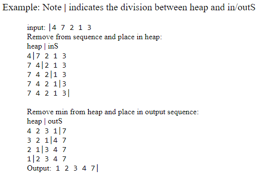

\pagebreak

# Map

Python uses dictionary to represent namespace. Can assume $O(1)$ lookup time.

\pagebreak

# Hash Table

Hash table is a lookup table structure that supports $O(1)$ lookup when implementing maps. The fast lookup is made possible by directly computing the hash table index from the map's key $k$ via a hash function $h(k)$.

## Hash Functions

We store the item $(k,v)$ in the bucket $A[h(k)]$.

A hash function has two parts:
1. Hash code: keys $\to \mathbb{Z}$.
2. Compression function: $\mathbb{Z} \to [0, N-1]$ ($N$ is the number of entries in the hash table).

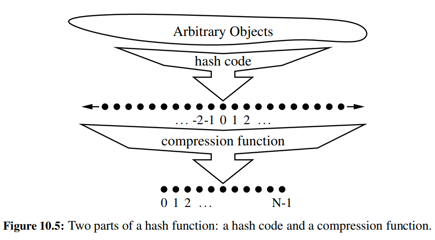

### Hash codes

1. Interpret keys are integers. If overflow, sum the upper and lower 32-bits, or take bitwise exclusive-or. Does not preserve meaningful order in the key's characters, if any.
2. Polynomial in nonzero constant $a$.  $x_0a^{n-1} + x_1a^{n-2} + \cdots + x_{n-2}a + x_{n-1}$
3. Cyclic shift. Sum each character in the key and shift the partial sum's bits cyclically in between.

### Compression functions

1. "Division Method": $x \to x\mod N$.
2. "MAD Method": $x \to [(ax + b) \mod p] \mod N$.

## Collision-handling schemes

### Separate Chaining

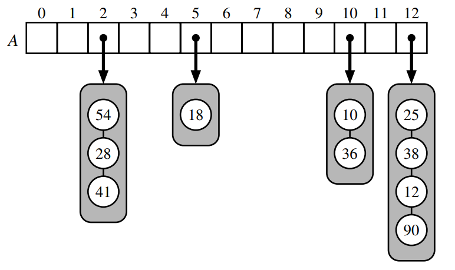

### Open Addressing

#### Linear Probing

Iteratively tries the buckets $A[(h(k)+ i) \mod N]$, for $i = 0, 1, 2,\ldots$, until finding
an empty bucket.

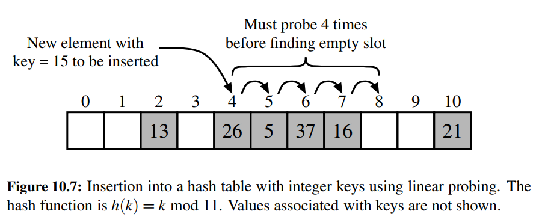

#### Quadratic Probing

Iteratively tries the buckets $A[(h(k)+ f(i)) \mod N]$, for $i = 0, 1, 2,\ldots$, where $f(i)=i^2$, until finding
an empty bucket.

#### Double Hashing

For secondary hash function $h'(i)$, iteratively tries the buckets $A[(h(k)+ f(i)) \mod N]$, for $i = 0, 1, 2,\ldots$, where $f(i)=i\cdot h'(i)$, until finding an empty bucket.

## Rehashing

**Load factor.** If $n$ is the number of entries in a bucket array of capacity $N$, then the hash table's load factor is $\lambda = n/N$.

For each collision-handling scheme, there's a load factor threshold. If the load factor exceeds the threshold, the lookup efficiency will start degrading. For separate chaining, this is $0.9$, linear probing $0.5$, and Python dictionary's opening addressing $2/3$.

After the threshold is exceeded, the hash table is usually resized to twice the capacity (and all entries rehashed) to restore efficiency.

## Sorted Search Table

A hash table where keys are sorted. The sortedness of the keys support inexact search such as searching for a range of keys.

Array-based implementation of the sorted search table allows $O(\log n)$ search via binary search, though update operations are $O(n)$ because elements need to be shifted.

## Set

**Set.** A set is an unordered collection of elements, without duplicates, that typically supports efficient membership tests (e.g., using hash tables). 

Sets are implemented using hash tables in Python. In fact, they are like maps with keys without values.

**Multiset.** A multiset is like a set but allows duplicates.

**Mutlimap.** A multimap is like a map but allows the same key to map to multiple values.

| Operation      | Description                                     |
|----------------|-------------------------------------------------|
| `S.add(e)`     | Add `e` to the set if it's not yet in the set.  |
| `S.discard(e)` | Remove `e` from the set if it's in the set.     |
| `e in S`       | True if `e` is in the set.                      |
| `len(S)`       | Return the number of elements in the set.       |
| `iter(S)`      | Return an iteration of the elements in the set. |

\pagebreak

# Search Tree

## Binary Search Tree

**Binary search tree.** A binary tree $T$ with each position $p$ storing a key-value pair $(k,v)$ such that:
• Keys in $p$'s left subtree are $< k$.
• Keys in $p$'s right subtree are $> k$.

**Proposition.** An inorder traversal of a binary search tree visits positions in increasing order of their keys.

**Successor of node.** The successor of the node at position $p$ is the node with the smallest value that is $>= p$ (the next node to visit right after $p$ in an inorder traversal). If $p$ has a right subtree, this is the leftmost node in its right subtree. Else, this is the nearest ancestor such that $p$ is in its left subtree.

**Predecessor of node.** The predecessor of the node at position $p$ is the node with the largest value that is $<= p$ (the node visited right before $p$ in an inorder traversal). If $p$ has a left subtree, this is the rightmost node in its left subtree. Else, this is the nearest ancestor such that $p$ is in its right subtree.

Efficiency of binary search in a binary search tree depends on its height:

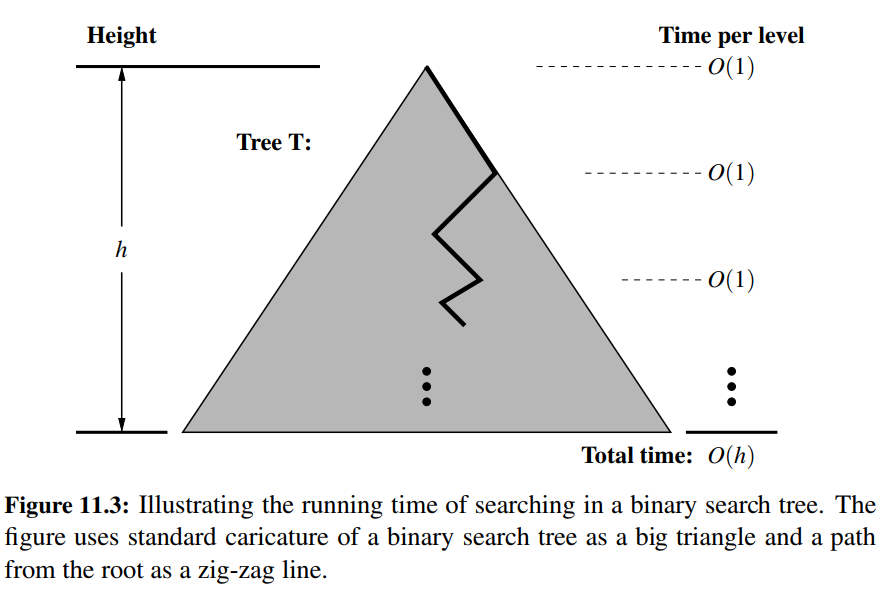

Deletion from binary search tree:

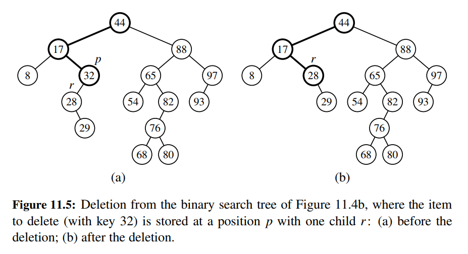

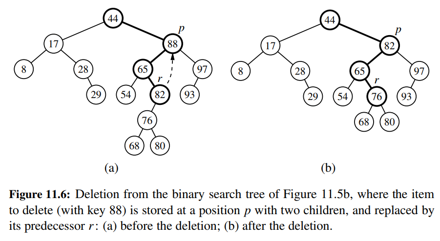

